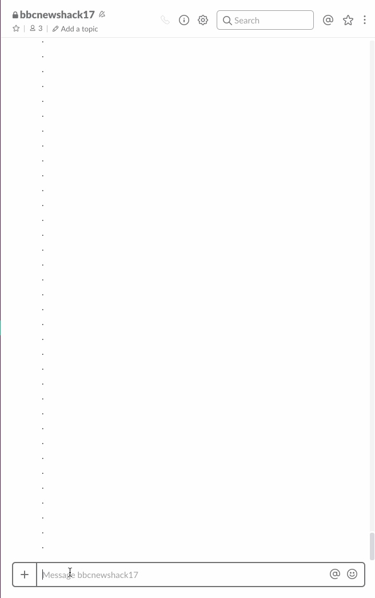
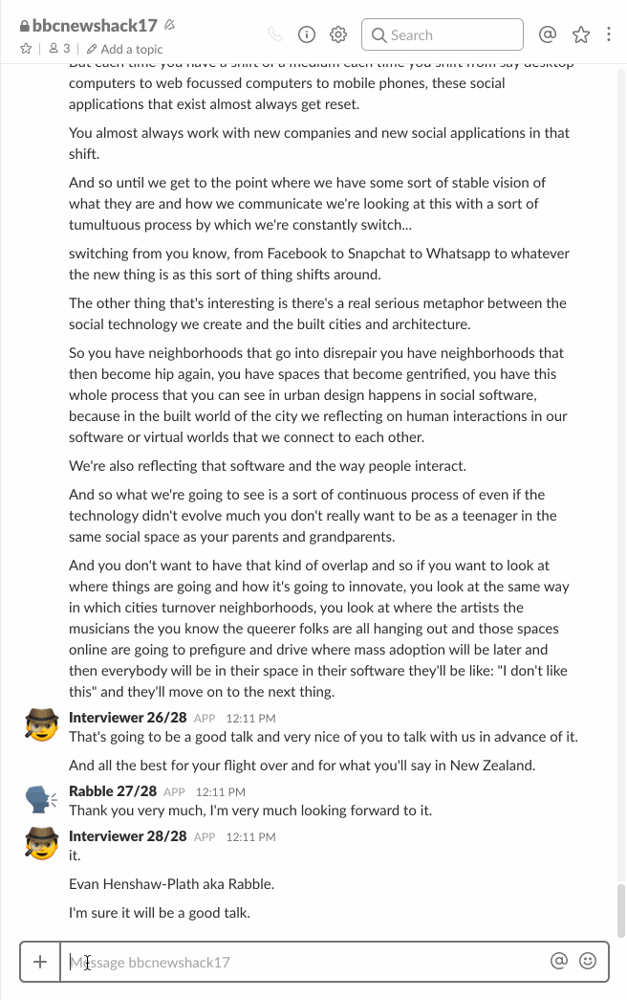

# Transcription Chat Bot

Proof of concept demo of chatbot conversational interface for transcription service.      

**Use case**: Journalist working with audio interviews, recorded on their smartphone, for a text article.      
**Prototype**: user uploads audio file onto slack channel, slack bot handles transcriptions, and allows user to query transcription, for questions, answers, both, and insight into the text.             

- [Presentation Slides](https://docs.google.com/presentation/d/1ky52Q9UJ9VV_gl6hKQWBS5GrOIARIqogwSZbkswXcY0/edit?usp=sharing)
- [Google doc tmp R&D draft](https://docs.google.com/document/d/1n6B1vyQysIEeDfoDUqnVNzb7RVy_MNuyvrVekLQ0YZ4/edit?usp=sharing)
- [Video of presentation]() _coming soon_.


## Demo giffs

- Adding an audio file triggeres the bot 
- You can then request a transcription `@bot transcribe`
- When the transcriptin is ready, after about 3 mintues, no matter the length of the media, you can view it with `@bot play`



- The bot can also provide you an automated summary/"most significant quotes" selection `@bot summary`



## Question verification component / summariztion 

Using ["Question Generation via Overgenerating Transformations and Ranking
"](https://www.cs.cmu.edu/~ark/mheilman/questions/) system, as a summarization tool.


```json 
{
	"speaker": "interviewee",
	"paragraphId": 1,
	"question":"What do I 'm coming to speak at open source to?",
	"answer": "Well I 'm coming to speak at open source open society to talk to people about how we can apply the concepts of the open source movement to larger parts of society.",
	"confidence": 1.2249347799141348
}		
```

Where question, answer, and confidence are what is returned by java jar, see this [exmaple output](https://gist.github.com/Laurian/1115914)


**INPUT**:

>"Napoleon Bonaparte was born on 15 August 1769 in Corsica into a gentry family. Educated at military school, he was rapidly promoted and in 1796, was made commander of the French army in Italy, where he forced Austria and its allies to make peace. In 1798, Napoleon conquered Ottoman-ruled Egypt in an attempt to strike at British trade routes with India. He was stranded when his fleet was destroyed by the British at the Battle of the Nile."

**OUTPUT** 

- **Question**: 

> What did Napoleon conquer Ottoman-ruled Egypt in in 1798?	

- **Source/Answer**: 

> In 1798, Napoleon conquered Ottoman-ruled Egypt in an attempt to strike at British trade routes with India. in an attempt to strike at British trade routes with India 

- **score**: 3.4447591093720233

```


## Contributors

- [Pietro](https://github.com/pietrop)
- [Laurian](https://github.com/Laurian)